# AWS CI/CD Pipeline Project 🚀

## Introduction

This project demonstrates the implementation of a complete **Continuous Integration and Continuous Deployment (CI/CD) pipeline** using AWS services. The pipeline automates the software delivery process from code commit to production deployment, ensuring faster, more reliable, and consistent deployments.

### Key Features ✨

- 🔄 **Automated Build Process** - Seamless code compilation and testing
- 🚀 **Continuous Deployment** - Automatic application deployment to target environments
- 🔗 **GitHub Integration** - Direct integration with GitHub repositories
- 📊 **Pipeline Monitoring** - Real-time tracking of deployment status
- 🛡️ **Secure Deployment** - IAM roles and policies for secure operations

### AWS Services Used 🛠️

- **AWS CodeBuild** - Automated build and testing
- **AWS CodeDeploy** - Application deployment automation
- **AWS CodePipeline** - End-to-end pipeline orchestration
- **GitHub** - Source code repository

---

## Project Architecture

This CI/CD pipeline consists of four main components that work together to automate the software delivery process:

1. **Source Stage** - Code repository (GitHub)
2. **Build Stage** - Code compilation and testing (CodeBuild)
3. **Deploy Stage** - Application deployment (CodeDeploy)
4. **Pipeline Orchestration** - Workflow management (CodePipeline)

---

## Implementation Steps

### A. Code Commit/GitHub Setup

For this CI/CD project, I have created a GitHub repository that implements a comprehensive continuous integration and continuous deployment pipeline.
`https://github.com/AbhayGhante/aws-cicd-pipeline`
Ensure the repository contains all essential configuration files including
`buildspec.yml` (Required for Build Stage) ⬇️

```yml
version: 0.2

env: # setup in aws-secrets-manager
  parameter-store:
    DOCKER_REGISTRY_USERNAME: /project/docker-credentials/username
    DOCKER_REGISTRY_PASSWORD: /project/docker-credentials/password
    DOCKER_REGISTRY_URL: /project/docker-credentials/url

phases:
  install:
    runtime-versions:
      python: 3.10
  pre_build:
    commands:
      - echo "Installing dependencies..."
      - pip install -r requirements.txt
  build:
    commands:
      - echo "docker logging"
      - echo "$DOCKER_REGISTRY_PASSWORD" | docker login -u "$DOCKER_REGISTRY_USERNAME" --password-stdin "$DOCKER_REGISTRY_URL"
      - echo "docker build"
      - docker build -t "$DOCKER_REGISTRY_URL/$DOCKER_REGISTRY_USERNAME/flask-app:latest" .
      - echo "build completed now pushing image to DOCKER_REGISTRY_URL"
      - docker push "$DOCKER_REGISTRY_URL/$DOCKER_REGISTRY_USERNAME/flask-app:latest"
  post_build:
    commands:
      - echo "Build completed successfully!"

artifacts:
  files:
    - "scripts/*"
    - "appspec.yml"
  base-directory: .
```

& `Appspec.yml` (Required for Deploy Stage) ⬇️

```yml
version: 0.0
os: linux

hooks:
  ApplicationStop:
    - location: /scripts/stop_container.sh # to delete the running container
      timeout: 300
      runas: root
  AfterInstall:
    - location: /scripts/start_container.sh # to run new container
      timeout: 300
      runas: root
```

### B. Code Build Configuration

#### 1. Create Build Project

Navigate to the CodeBuild dashboard and click on **Create Project**.

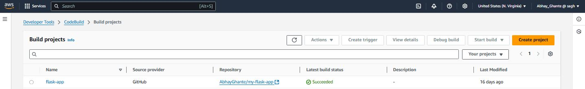

#### 2. Configure Project Settings

Provide a meaningful project name and select **GitHub** as the source provider since we're using GitHub repository instead of AWS CodeCommit.

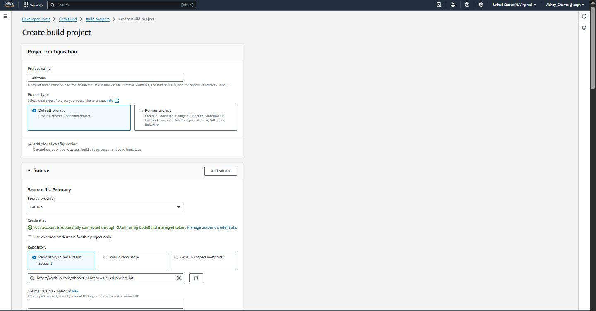

Configure the appropriate environment settings and specify the `buildspec.yml` file name that exists in your GitHub repository. Click **Create Build Project** to proceed.

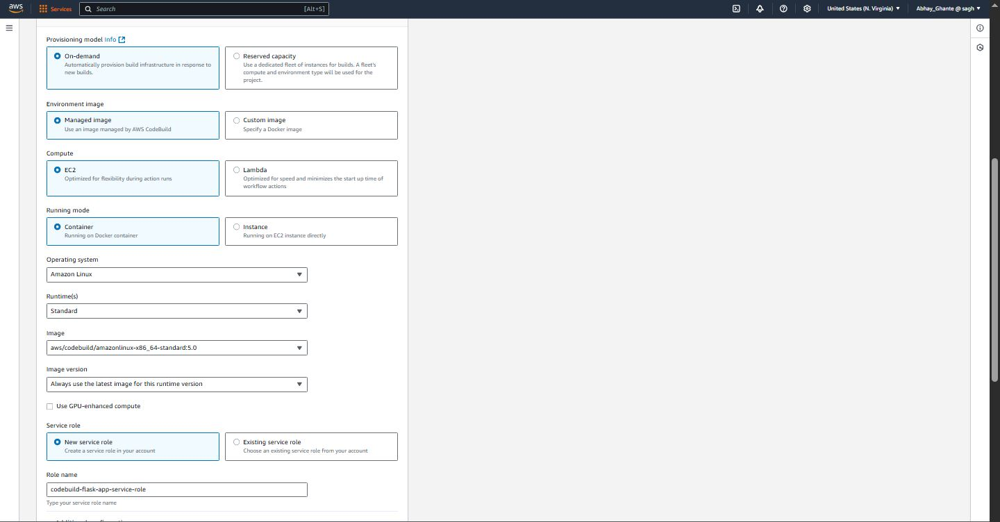
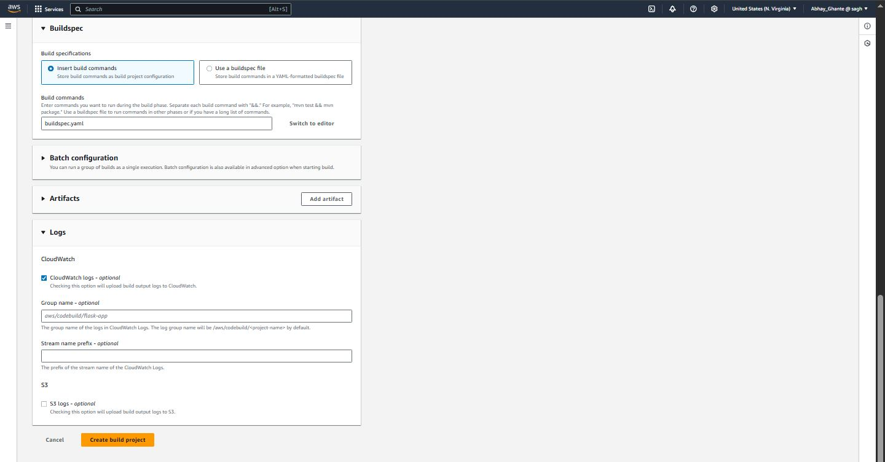

#### 3. Test Build Execution

Click **Start Build** to verify that the build process executes correctly and all configurations are properly set.

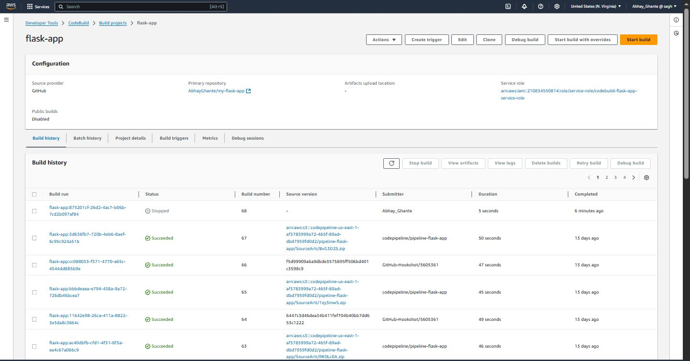

> **After this stage, the Docker image is built and then pushed to the registry for storage and deployment**

> **Note:** This completes the Continuous Integration (CI) portion of the pipeline.

### C. Code Deploy Configuration

#### 1. Create Application

Navigate to the CodeDeploy dashboard and click **Create Application**.

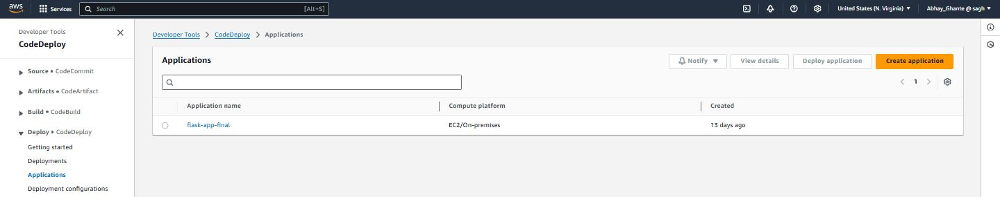

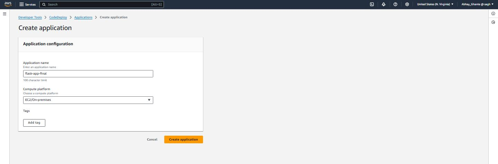

#### 2. Create Deployment Group

After successfully creating the application, click **Create Deployment Group**.

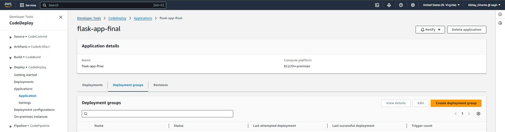

#### 3. Configure Deployment Group

Provide an appropriate name for the deployment group, select the proper service role, choose deployment type, configure environment settings, and click **Create Deployment Group**.

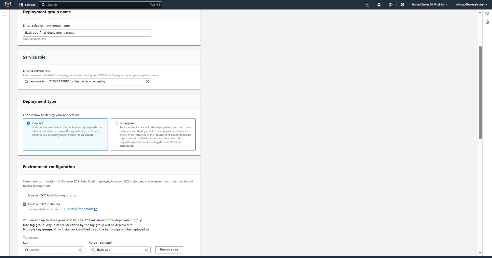

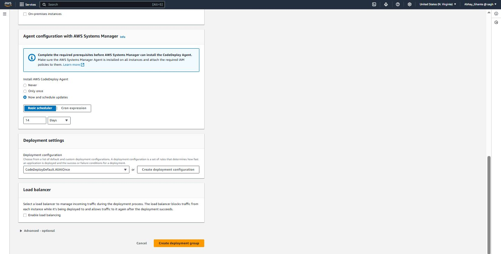

#### 4. Create Deployment

After creating the deployment group, create a new deployment with an appropriate name, select the GitHub option, and click **Create Deployment**.

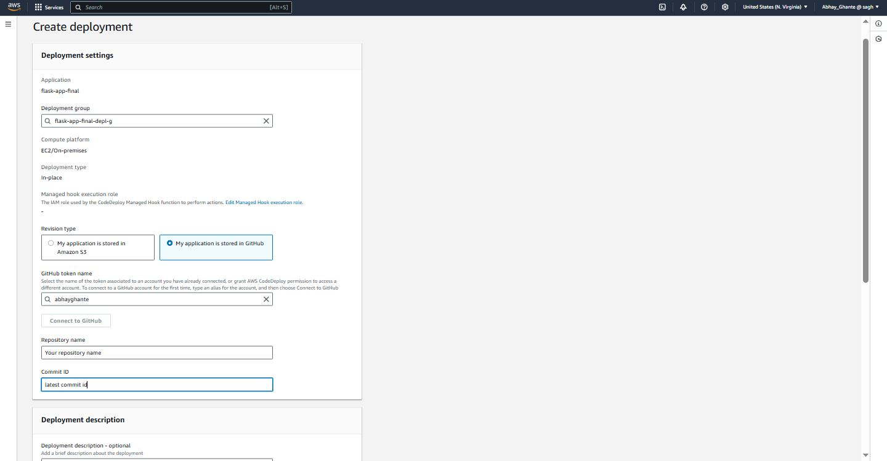
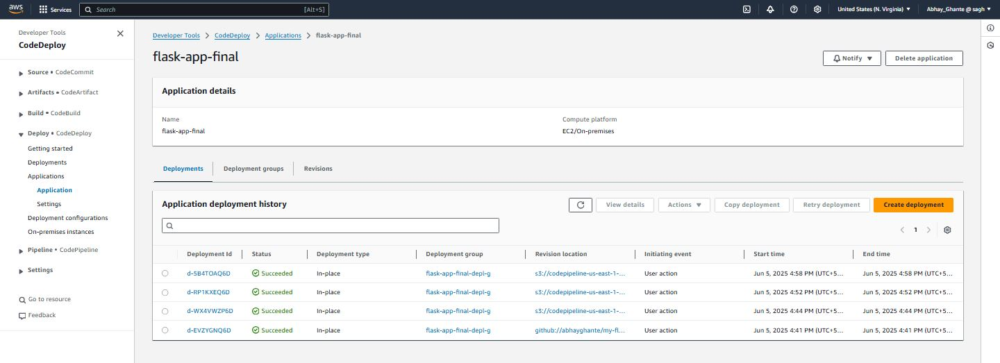

> **The `appspec.yml` file present in your GitHub repository is used by CodeDeploy during the deployment process**

> **Note:** This completes the Continuous Deployment (CD) portion of the pipeline.

### D. Code Pipeline Setup

#### 1. Access Pipeline Dashboard

Navigate to the CodePipeline dashboard and click **Create Pipeline**.

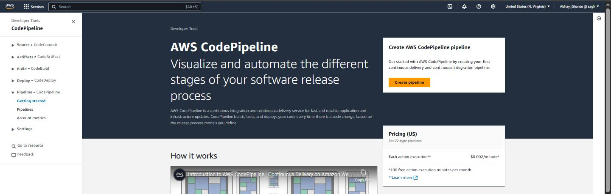

#### 2. Pipeline Configuration Steps

Follow these sequential steps to configure your pipeline:

**Step 1: Choose Creation Option**
Select **Build Custom Pipeline** for maximum flexibility.

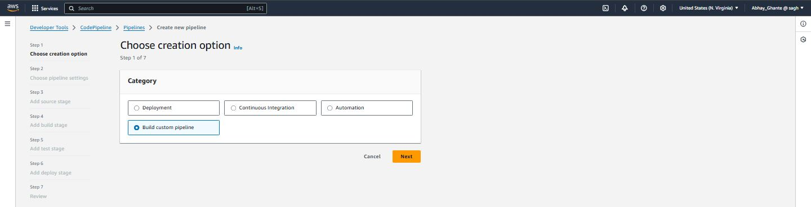

**Step 2: Configure Pipeline Settings**
Provide a descriptive pipeline name and select the appropriate service role.

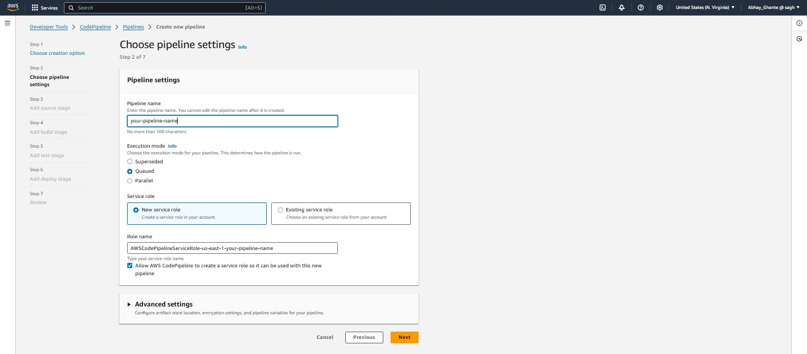

**Step 3: Add Source Stage**
Select the source provider (GitHub), specify your repository name, and choose the target branch.

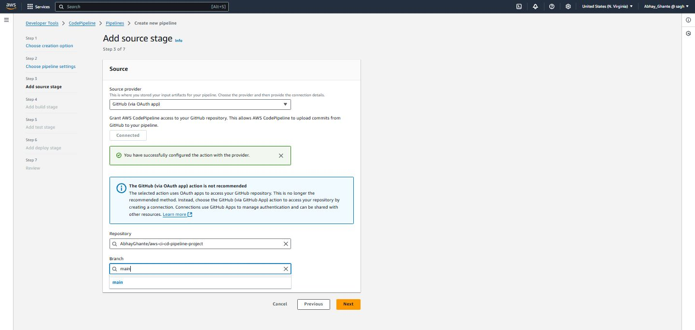

**Step 4: Add Build Stage**
Select the build provider (CodeBuild) and specify your project name created in the previous steps.

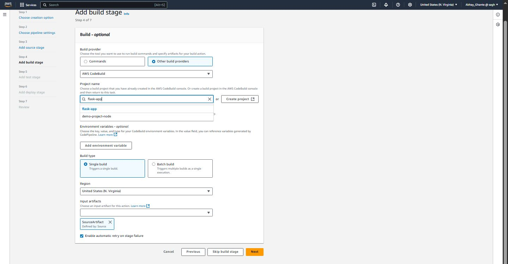

**Step 5: Add Deploy Stage**
Select the deploy provider (CodeDeploy), specify the application name and deployment group created earlier, then click **Create Pipeline**.

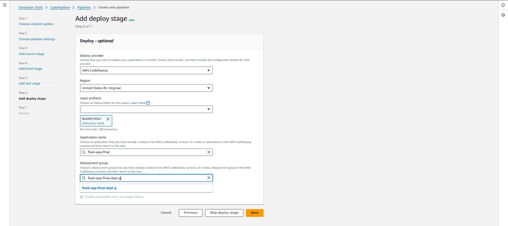
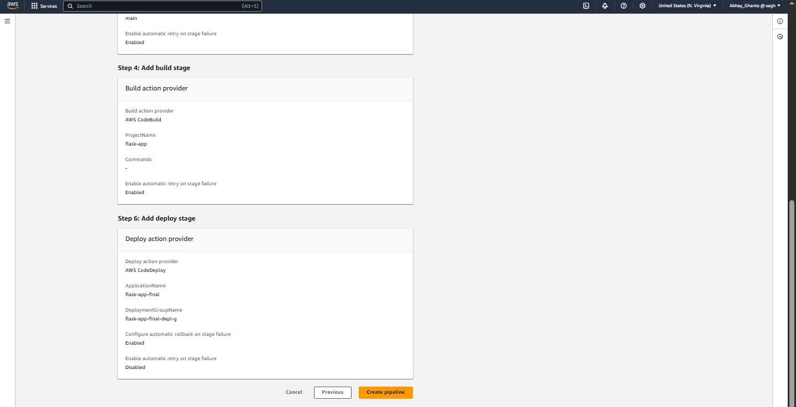

---

## Pipeline Workflow

1. **Code Push** → Developer pushes code to GitHub repository
2. **Trigger** → Pipeline automatically detects changes
3. **Build** → CodeBuild compiles and tests the application
4. **Deploy** → CodeDeploy deploys the application to target environment
5. **Monitor** → Pipeline status and logs are available in real-time

---

## 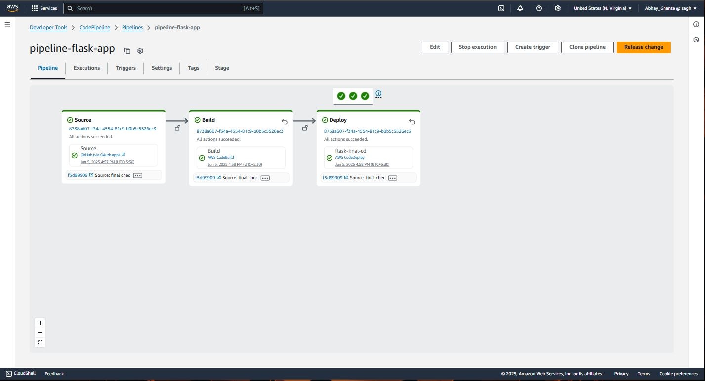

## Best Practices

- 📝 Always include comprehensive `buildspec.yml` configuration
- 🔐 Use least-privilege IAM roles and policies
- 🧪 Test your pipeline with small changes before major deployments
- 📊 Monitor pipeline execution logs for troubleshooting
- 🔄 Implement proper rollback strategies

---

## Troubleshooting

Common issues and solutions:

- **Build Failures**: Check `buildspec.yml` syntax and environment configurations
- **Deployment Errors**: Verify IAM roles and target environment accessibility
- **Pipeline Stuck**: Review service roles and permissions

---

## Contributing

Feel free to contribute to this project by submitting issues or pull requests.
